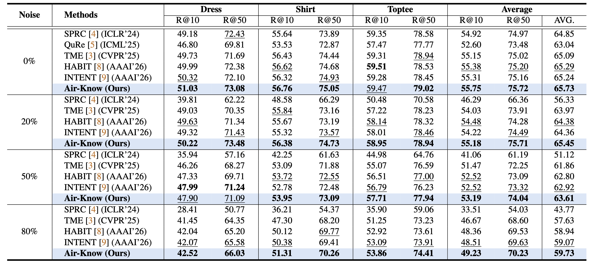
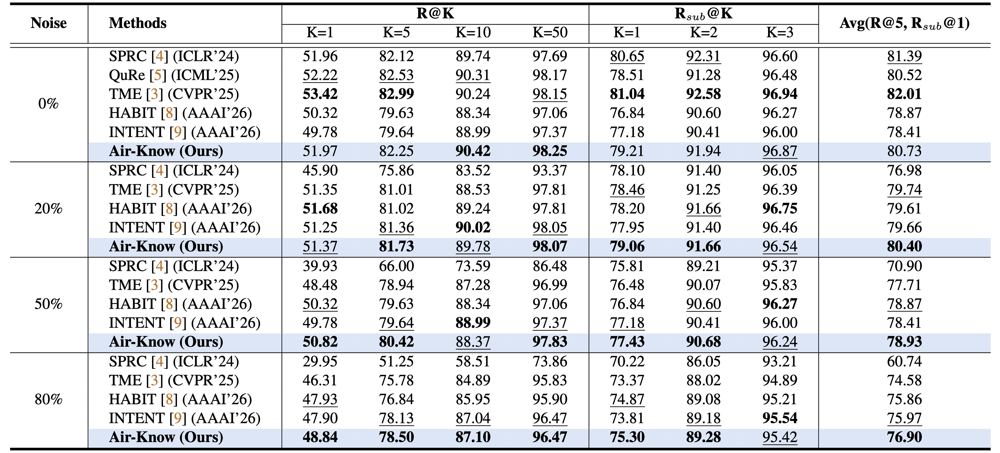

<a id="top"></a>
<div align="center">
  
  <h1>[CVPR 2026] Air-Know: Arbiter-Calibrated Knowledge-Internalizing Robust Network for Composed Image Retrieval</h1>
<p align="center">
    <a href="https://zhihfu.github.io/"><strong>Zhiheng Fu</strong></a><sup>1</sup>
    &nbsp;&nbsp;
    <a target="_blank" href="https://faculty.sdu.edu.cn/huyupeng1/zh_CN/index.htm">Yupeng&#160;Hu</a><sup>1&#9993</sup>,
     &nbsp;&nbsp;
    <strong>Qianyun Yang</strong><sup>1</sup>
      &nbsp;&nbsp;
    <strong>Shiqi Zhang</strong><sup>1</sup>
    &nbsp;&nbsp;
    <a href="https://zivchen-ty.github.io/"><strong>Zhiwei Chen</strong></a><sup>1</sup>
    &nbsp;&nbsp;
    <a href="https://lee-zixu.github.io/"><strong>Zixu Li</strong></a><sup>1</sup>
  </p>
    <sup>1</sup>School of Software, Shandong University &#160&#160&#160</span>
  <br />
  <sup>&#9993&#160;</sup>Corresponding author&#160;&#160;</span>
  <br/>
  <!-- <br />
 <sup>2</sup>School of Computer Science and Technology, Harbin Institute of Technology (Shenzhen), &#160&#160&#160</span>  <br /> -->
 
  <br>
    <div align="center">
    
  </div>
  <p>
      <a href="https://arxiv.org/abs/coming soon"></a>
      <a href=""></a>
    <a href="https://zhihfu.github.io/Air-Know.github.io/"></a>
    <a href="https://zhihfu.github.io"></a>
    <a href="https://pytorch.org/get-started/locally/"></a>
    
    <a href="https://github.com/ZhihFu/Air-Know"></a>
  </p>
</div>


## 📌 Introduction
Welcome to the official repository for **Air-Know**. This is about <a href="https://github.com/XLearning-SCU/Awesome-Noisy-Correspondence">Noisy Correspondence Learning (NCL)</a> and <a href="https://github.com/haokunwen/Awesome-Composed-Image-Retrieval">Composed Image Retrieval (CIR)</a>.

*Disclaimer: This codebase is intended for research purposes.*

## 📢 News and Updates
* **[2026-04-02]** 🚀 All codes are released.
* **[2026-02-21]** 🔥 Air-Know is accepted by **CVPR 2026**. Codes are coming soon.

---
### Air-Know Pipeline (based on [LAVIS](https://github.com/chiangsonw/cala?tab=readme-ov-file))
<p align="center">
  
  <figcaption><strong>Figure 1.</strong> The proposed Air-Know consists of three primary modules: (a) External Prior Arbitration leverages an offline multimodal expert to generate reliable arbitration priors for CIR triplets, bypassing the unreliable small-loss hypothesis. (b) Expert-Knowledge Internalization transfers these priors into a lightweight proxy network, structurally preventing the memorization of ambiguous partial matches. Finally, (c) Dual-Stream Reconciliation dynamically integrates the internalized knowledge to provide robust online feedback, guiding the final representation learning. Figure best viewed in color. </figcaption>
</p>


## Table of Contents
- [Experiment Results](#-experiment-results)
- [Install](#-install)
- [Project Structure](#-project-structure)
- [Data Preparation](#-data-preparation)
- [Quick Start](#-quick-start)
- [Acknowledgement](#-acknowledgement)
- [Contact](#-contact)
- [Related Projects](#-related-projects)
- [Citation](#-citation)


## 🏃‍♂️ Experiment-Results

### CIR Task Performance

> 💡 <span style="color:#2980b9;">**Note for Fully-Supervised CIR Benchmarking:**</span> <br>
> 🎯 The **0% noise** setting in the tables below is equivalent to the **traditional fully-supervised CIR** paradigm. We highlight this `0%` block to facilitate direct and fair comparisons for researchers working on conventional supervised methods.


#### FashionIQ:

<caption><strong>Table 1.</strong> Performance comparison on FashionIQ validation set in terms of R@K (%). The best result under each noise ratio is highlighted in bold, while the second-best result is underlined.</caption>



#### CIRR:

<caption><strong>Table 2.</strong> Performance comparison on the CIRR test set in terms of R@K (%) and Rsub@K (%). The best and second-best results are highlighted in bold and underlined, respectively.</caption>



[⬆ Back to top](#top)

---

## 📦 Install

**1. Clone the repository**

```bash
git clone https://github.com/ZhihFu/Air-Know
cd Air-Know
```

**2. Setup Python Environment**

The code is evaluated on **Python 3.8.10** and **CUDA 12.6**. We recommend using Anaconda to create an isolated virtual environment:

```bash
conda create -n conesep python=3.8
conda activate conesep

# Install PyTorch (The evaluated environment uses Torch 2.1.0 with CUDA 12.1 compatibility)
pip install torch==2.1.0 torchvision==0.16.0 torchaudio==2.1.0 --index-url [https://download.pytorch.org/whl/cu121](https://download.pytorch.org/whl/cu121)

# Install core dependencies
pip install scikit-learn==1.3.2 transformers==4.25.0 salesforce-lavis==1.0.2 timm==0.9.16
```
[⬆ Back to top](#top)

-----


## 📂 Project Structure
To help you navigate our codebase quickly, here is an overview of the main components:

```text
├── lavis/                 # Core model directory (built upon LAVIS)
│   └── models/
│       └── blip2_models/
│           └── blip2_cir.py   # 🧠 The core model implementation.
├── train_BLIP2.py        # 🚂 Main training script
├── test_BLIP2.py                # 🧪 General evaluation script
├── cirr_sub_BLIP2.py      # 📤 Script to generate submission files for the CIRR dataset
├── datasets.py            # 📊 Data loading and processing utilities
└── utils.py               # 🛠️ Helper functions (logging, metrics, etc.)
```


## 💾 Data Preparation
Before training or testing, you need to download and structure the datasets.

Download the CIRR / FashionIQ dataset from [CIRR official repo](https://github.com/Cuberick-Orion/CIRR) and [FashionIQ official repo](https://github.com/XiaoxiaoGuo/fashion-iq).

Organize the data as follows:


#### 1) FashionIQ:
```
├── FashionIQ
│   ├── captions
|   |   ├── cap.dress.[train | val].json
|   |   ├── cap.toptee.[train | val].json
|   |   ├── cap.shirt.[train | val].json

│   ├── image_splits
|   |   ├── split.dress.[train | val | test].json
|   |   ├── split.toptee.[train | val | test].json
|   |   ├── split.shirt.[train | val | test].json

│   ├── dress
|   |   ├── [B000ALGQSY.jpg | B000AY2892.jpg | B000AYI3L4.jpg |...]

│   ├── shirt
|   |   ├── [B00006M009.jpg | B00006M00B.jpg | B00006M6IH.jpg | ...]

│   ├── toptee
|   |   ├── [B0000DZQD6.jpg | B000A33FTU.jpg | B000AS2OVA.jpg | ...]
```
#### 2) CIRR:
```
├── CIRR
│   ├── train
|   |   ├── [0 | 1 | 2 | ...]
|   |   |   ├── [train-10108-0-img0.png | train-10108-0-img1.png | ...]

│   ├── dev
|   |   ├── [dev-0-0-img0.png | dev-0-0-img1.png | ...]

│   ├── test1
|   |   ├── [test1-0-0-img0.png | test1-0-0-img1.png | ...]

│   ├── cirr
|   |   ├── captions
|   |   |   ├── cap.rc2.[train | val | test1].json
|   |   ├── image_splits
|   |   |   ├── split.rc2.[train | val | test1].json
```
*(Note: Please modify datasets.py if your local data paths differ from the default setup.)*


[⬆ Back to top](#top)

-----

## 🚀 Quick Start

### 1\. Training under Noisy Settings

In our implementation, we introduce the `noise_ratio` parameter to simulate varying degrees of NTC (Noisy Triplet Correspondence) interference. You can reproduce the experimental results from the paper by modifying the `--noise_ratio` parameter (default options evaluated are `0.0`, `0.2`, `0.5`, `0.8`).

**Training on FashionIQ:**

```bash
python train_BLIP2.py \
    --dataset fashioniq \
    --fashioniq_path "/path/to/FashionIQ/" \
    --model_dir "./checkpoints/fashioniq_noise0.8" \
    --noise_ratio 0.8 \
    --batch_size 256 \
    --num_epochs 20 \
    --lr 1e-5
```

**Training on CIRR:**

```bash
python train_BLIP2.py \
    --dataset cirr \
    --cirr_path "/path/to/CIRR/" \
    --model_dir "./checkpoints/cirr_noise0.8" \
    --noise_ratio 0.8 \
    --batch_size 256 \
    --num_epochs 20 \
    --lr 2e-5
```

### 2\. Testing

To generate the prediction files on the CIRR dataset for submission to the [CIRR Evaluation Server](https://cirr.cecs.anu.edu.au/), run the following command:

```bash
python src/cirr_test_submission.py checkpoints/cirr_noise0.8/
```

*(The corresponding script will automatically output `.json` based on the generated best checkpoints in the folder for online evaluation.)*

[⬆ Back to top](#top)

-----

## 🙏 Acknowledgements
This codebase is heavily inspired by and built upon the excellent [Salesforce LAVIS](https://github.com/chiangsonw/cala?tab=readme-ov-file), [SPRC](https://github.com/chunmeifeng/SPRC) and [TME](https://github.com/He-Changhao/2025-CVPR-TME) library. We thank the authors for their open-source contributions.

[⬆ Back to top](#top)

## ✉️ Contact

For any questions, issues, or feedback, please open an [issue](https://github.com/ZhihFu/Air-Know/issues) on GitHub or reach out to us at fuzhiheng8@gmail.com

[⬆ Back to top](#top)

## 🔗 Related Projects

*Ecosystem & Other Works from our Team*

<table style="width:100%; border:none; text-align:center; background-color:transparent;">
  <tr style="border:none;">
   <td style="width:30%; border:none; vertical-align:top; padding-top:30px;">
      <br>
      <b>ConeSep (CVPR'26)</b><br>
      <span style="font-size: 0.9em;">
        <a href="https://lee-zixu.github.io/ConeSep.github.io/" target="_blank">Web</a> | 
        <a href="https://github.com/Lee-zixu/ConeSep" target="_blank">Code</a> | 
        <!-- <a href="https://ojs.aaai.org/index.php/AAAI/article/view/37608" target="_blank">Paper</a> -->
      </span>
    </td>
    <td style="width:30%; border:none; vertical-align:top; padding-top:30px;">
      <br>
      <b>HABIT (AAAI'26)</b><br>
      <span style="font-size: 0.9em;">
        <a href="https://lee-zixu.github.io/HABIT.github.io/" target="_blank">Web</a> | 
        <a href="https://github.com/Lee-zixu/HABIT" target="_blank">Code</a> | 
        <a href="https://ojs.aaai.org/index.php/AAAI/article/view/37608" target="_blank">Paper</a>
      </span>
    </td>
    <td style="width:30%; border:none; vertical-align:top; padding-top:30px;">
      <br>
      <b>ReTrack (AAAI'26)</b><br>
      <span style="font-size: 0.9em;">
        <a href="https://lee-zixu.github.io/ReTrack.github.io/" target="_blank">Web</a> | 
        <a href="https://github.com/Lee-zixu/ReTrack" target="_blank">Code</a> | 
        <a href="https://ojs.aaai.org/index.php/AAAI/article/view/39507" target="_blank">Paper</a>
      </span>
    </td>
    <td style="width:30%; border:none; vertical-align:top; padding-top:30px;">
      <br>
      <b>INTENT (AAAI'26)</b><br>
      <span style="font-size: 0.9em;">
        <a href="https://zivchen-ty.github.io/INTENT.github.io/" target="_blank">Web</a> | 
        <a href="https://github.com/ZivChen-Ty/INTENT" target="_blank">Code</a> | 
        <a href="https://ojs.aaai.org/index.php/AAAI/article/view/39181" target="_blank">Paper</a>
      </span>
    </td>  
    </tr>
  <tr style="border:none;">
    <td style="width:30%; border:none; vertical-align:top; padding-top:30px;">
      <br>
      <b>HUD (ACM MM'25)</b><br>
      <span style="font-size: 0.9em;">
        <a href="https://zivchen-ty.github.io/HUD.github.io/" target="_blank">Web</a> | 
        <a href="https://github.com/ZivChen-Ty/HUD" target="_blank">Code</a> | 
        <a href="https://dl.acm.org/doi/10.1145/3746027.3755445" target="_blank">Paper</a>
      </span>
    </td>
    <td style="width:30%; border:none; vertical-align:top; padding-top:30px;">
      <br>
      <b>OFFSET (ACM MM'25)</b><br>
      <span style="font-size: 0.9em;">
        <a href="https://zivchen-ty.github.io/OFFSET.github.io/" target="_blank">Web</a> | 
        <a href="https://github.com/ZivChen-Ty/OFFSET" target="_blank">Code</a> | 
        <a href="https://dl.acm.org/doi/10.1145/3746027.3755366" target="_blank">Paper</a>
      </span>
    </td>
    <td style="width:30%; border:none; vertical-align:top; padding-top:30px;">
      <br>
      <b>ENCODER (AAAI'25)</b><br>
      <span style="font-size: 0.9em;">
        <a href="https://sdu-l.github.io/ENCODER.github.io/" target="_blank">Web</a> | 
        <a href="https://github.com/Lee-zixu/ENCODER" target="_blank">Code</a> | 
        <a href="https://ojs.aaai.org/index.php/AAAI/article/view/32541" target="_blank">Paper</a>
      </span>
    </td>
  </tr>
</table>


## 📝⭐️ Citation

If you find our work or this code useful in your research, please consider leaving a **Star**⭐️ or **Citing**📝 our paper 🥰. Your support is our greatest motivation\!

```bibtex
@InProceedings{Air-Know,
    title={Air-Know: Arbiter-Calibrated Knowledge-Internalizing Robust Network for Composed Image Retrieval},
    author={Fu, Zhiheng and Hu, Yupeng and Qianyun Yang and Shiqi Zhang and Chen, Zhiwei and Li, Zixu},
    booktitle={Proceedings of the Computer Vision and Pattern Recognition Conference (CVPR)},
    year = {2026}
}
```

[⬆ Back to top](#top)

---

<div align="center">

**If this project helps you, please leave a Star!**

[](https://github.com/ZhihFu/Air-Know)


</div>
